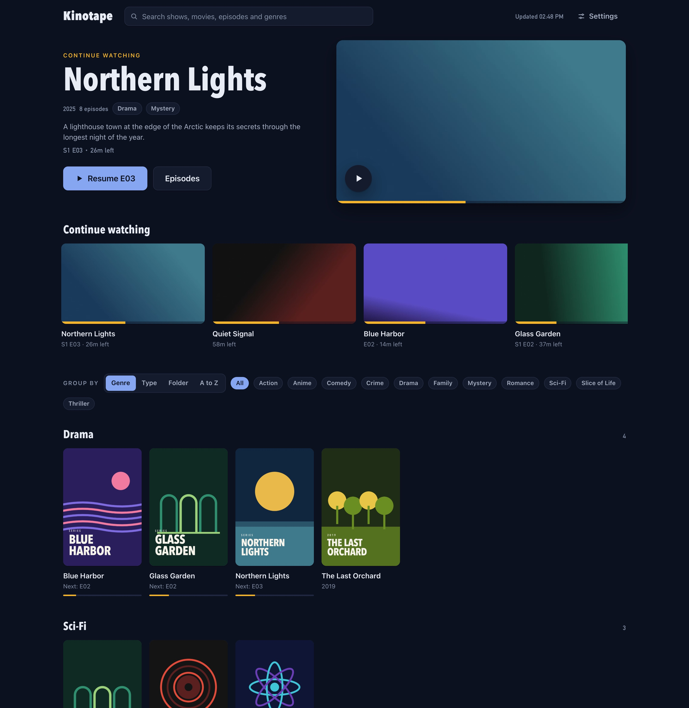
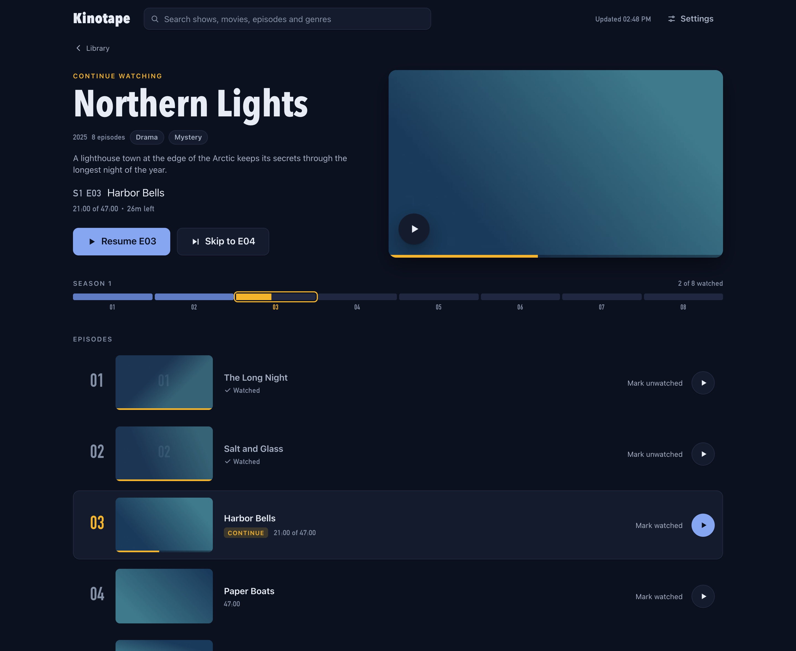
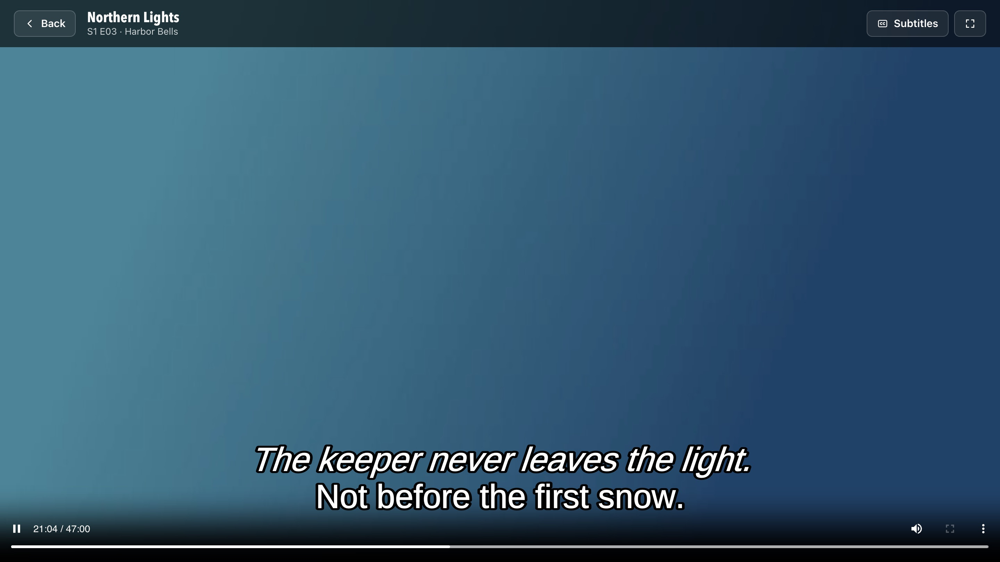
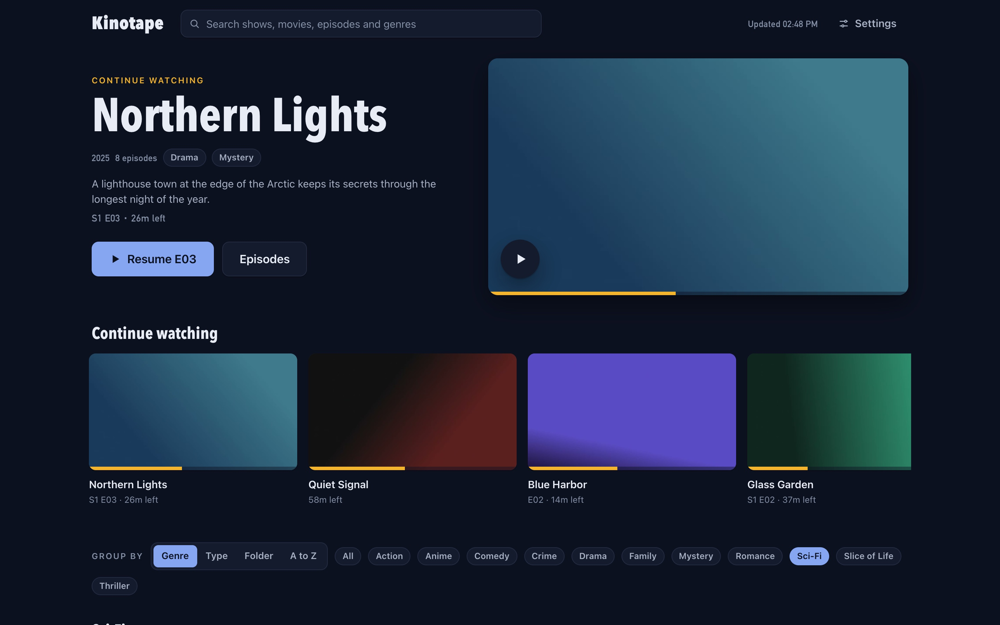
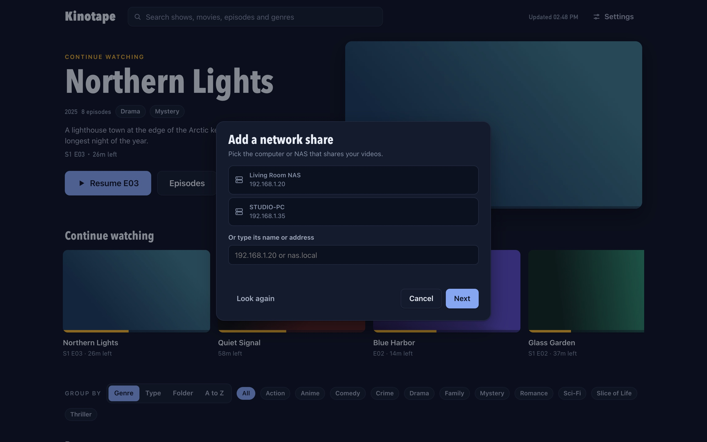

# Kinotape

A Netflix-style home for the videos on your computer and your network shares. Kinotape sorts your files into shows, seasons and films, finds posters and genres, remembers where you stopped, and plays the next episode for you. It runs on macOS and Windows as one small app.



## Features

- **Your files, organised.** Point Kinotape at folders and it recognises TV episodes (`S01E07`, `1x07`, `Show - 07`), films with their year, seasons in subfolders, and anime fansub names. Trailers, samples and extras folders are skipped.
- **Network shares built in.** Kinotape talks SMB itself, so a NAS, a Windows PC or a Samba server works without mounting anything. It finds servers on your network and lets you pick a share and folder.
- **Picks up where you left off.** Every episode remembers its position. The home page leads with what to continue, and each show has a season bar that shows how far you are.
- **Plays the next episode.** When an episode ends, the next one starts after a short countdown. There's a Skip button for the opening and a Next episode button during the credits.
- **Subtitles with their real styling.** Embedded subtitles, including styled ASS subtitles and the fonts packed into the file, are drawn with libass, the same engine desktop players use. You pick a language from the player.
- **Posters, genres and search.** Artwork and genres come from AniList, TVmaze and Wikipedia, or TMDB if you add a key. Search across shows, films, episodes and genres, and group the library by genre, type, folder or A to Z.
- **Original quality.** Videos stream to the player byte for byte, with no re-encoding, so they keep their full resolution and frame rate.

| A show's page | The player |
|---|---|
|  |  |
| **Filtering by genre** | **Adding a network share** |
|  |  |

The titles and posters in these screenshots are made up for the demo.

## Getting started

Kinotape needs two things installed:

- **ffmpeg**, for thumbnails, lengths and subtitles. On macOS run `brew install ffmpeg`. On Windows run `winget install ffmpeg`, or put `ffmpeg.exe` and `ffprobe.exe` next to `Kinotape.exe`.
- **Chrome, Edge or Brave**, which Kinotape uses as its app window. Other browsers work if you open the address yourself.

### Build from source

You need [Go](https://go.dev/dl/) 1.26 or newer.

```sh
git clone https://github.com/arifBurakDemiray/kinotape.git
cd kinotape
./build.sh           # on a Mac: writes dist/Kinotape-macOS.zip and dist/Kinotape.exe
./build.sh install   # also puts Kinotape.app in ~/Applications
```

On Windows, build the app directly with `go build -ldflags "-H=windowsgui" -o Kinotape.exe .`

To try it without building an app, run `go run . serve` and open http://127.0.0.1:8765/.

The builds are not signed. The first time you open Kinotape on macOS, right-click the app and choose Open. On Windows, choose More info, then Run anyway.

### Using it

1. Open Kinotape. It starts a small background service and opens its window.
2. Choose **Add a folder** or **Add a network share**. For a share, pick a server Kinotape found or type its address, sign in (or connect as a guest), then pick the share and folder.
3. Play something. Kinotape remembers your place.

To stop the background service, open **Settings** and choose **Quit Kinotape**.

### Keyboard shortcuts in the player

| Key | Does |
|---|---|
| Space or K | Play and pause |
| Left and right arrows, or J and L | Back and forward 10 seconds |
| S | Skip 85 seconds, for openings |
| N and P | Next and previous episode |
| C | Subtitles on and off |
| F | Full screen |
| M | Mute |
| Esc | Back to the library |

Press `/` in the library to jump to search.

## Privacy

- Kinotape only listens on your own computer (`127.0.0.1`). Nothing on your network or the internet can reach it.
- To find posters and genres, it sends show and film titles to AniList, TVmaze and Wikipedia, and to TMDB if you add a key. You can turn this off in Settings. Nothing else leaves your computer.
- Share passwords are kept in your system's keychain (Keychain on macOS, Credential Manager on Windows).
- Settings and watch history stay on your computer: in `~/Library/Application Support/Kinotape` on macOS and `%AppData%\Kinotape` on Windows.

## Limitations

- Files whose sound is Dolby Digital, DTS or TrueHD can't play in the browser, so Kinotape offers to open them in your usual video player.
- The player uses a file's first audio track; there's no audio track switching yet.
- The Windows build is newer and less tested than the macOS one.

## Contributing

The code is plain Go with a single-file web UI and no build step for the front end. [CLAUDE.md](CLAUDE.md) explains the layout, how the pieces fit together, the conventions and how to test, for people and coding agents alike.

## License

Kinotape is released under the [MIT License](LICENSE).

It bundles [JASSUB](https://github.com/ThaUnknown/jassub) (MIT) in `ui/vendor/jassub`, which includes libass and its dependencies compiled to WebAssembly. Those carry their own licenses (including LGPL-2.1-or-later, the FreeType License, MIT, ISC and Zlib). Go dependencies: [go-smb2](https://github.com/cloudsoda/go-smb2) (BSD-2-Clause), [go-keyring](https://github.com/zalando/go-keyring) (MIT), and `golang.org/x/net` and `golang.org/x/text` (BSD-3-Clause).
